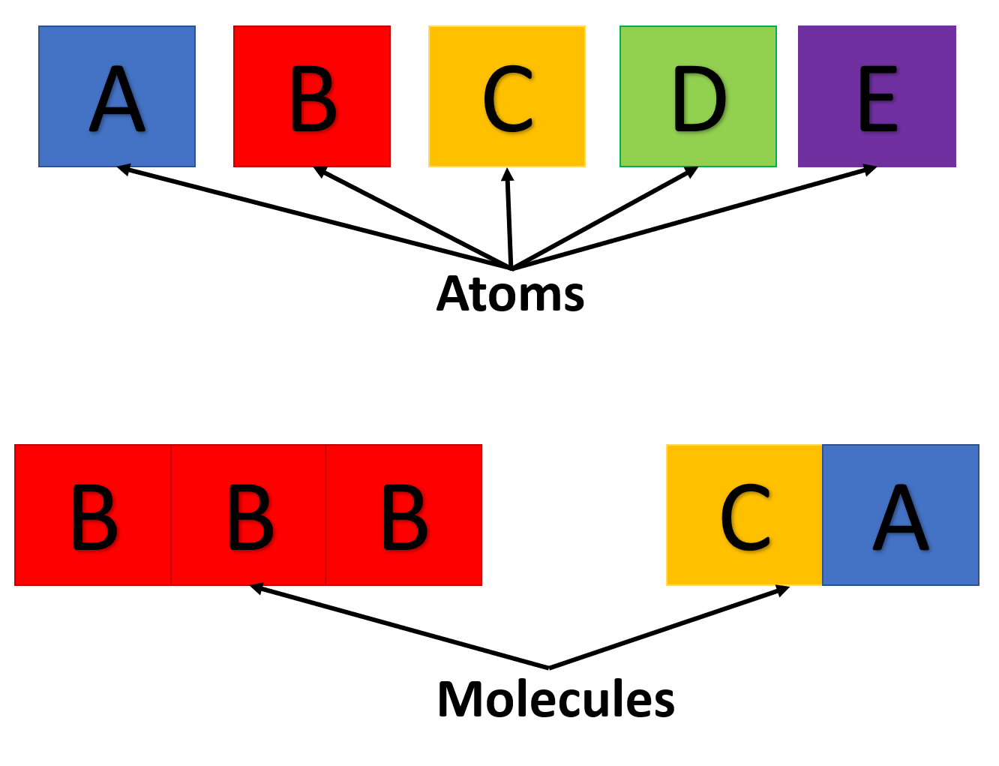
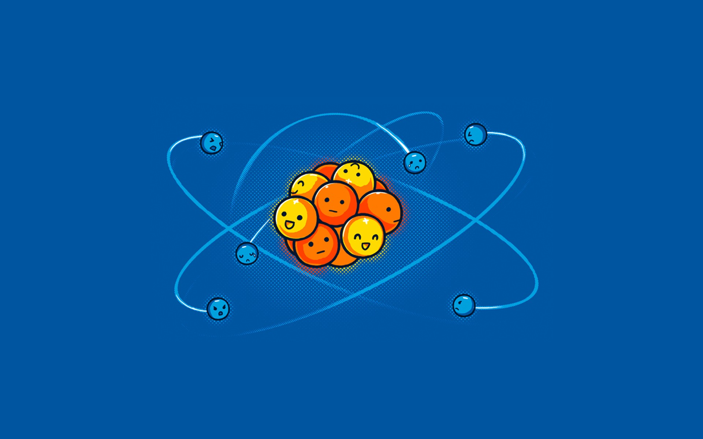
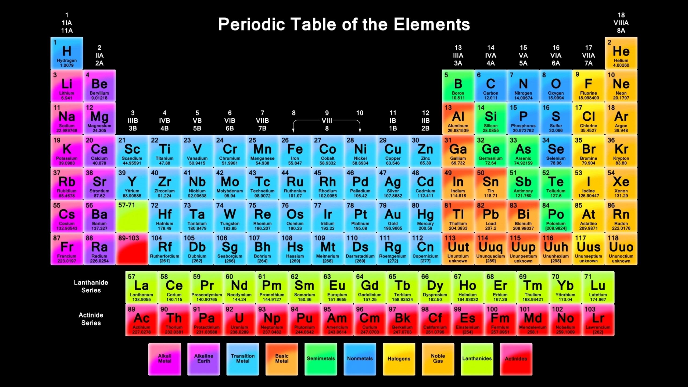
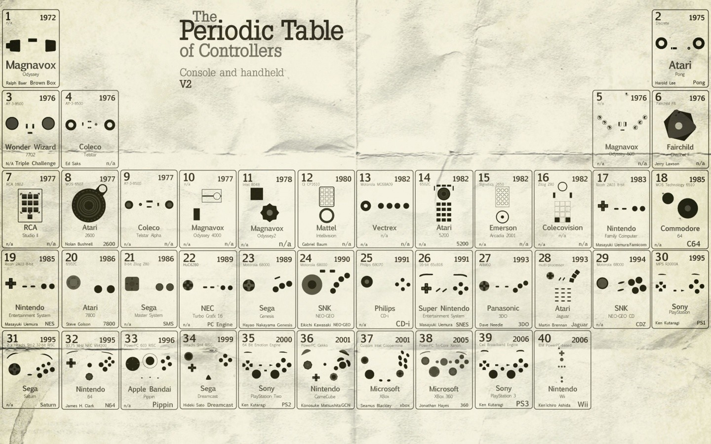

# Lecture I: Building Blocks

## Formal Language

Some parts of this document, and the course on whole might seem a little more "dry" than normal. The reason behind this is the need to be **unambiguous** (have only one meaning) while describing our basic building blocks.

> Like a pretty house built on sturdy bricks, each brick need not be pretty individually, but is simply the most stable base structure.

This rigor in our thoughts and expressions will be beneficial when we start programming as well!! (computers are not very creative)

That said, analogies and critical thinking are what make us human!

## Atoms

- Atoms are (for us) the smallest, stable, indivisible particles of **matter**
- Matter in our lexicon (grammar) is anything which exists (observed or not!)

To understand this better, consider:

> An analogy for atoms is how a shirt might seem smooth, even though it is made of fibers

## Molecules

> Given that atoms are a single object, how do these combine to give various other kinds of objects?

Let us imagine that we are learning a new language.

- The **atoms** like the **alphabet**
- The **molecules** are like **words**
- Larger molecules are like sentences

|  |
| :-----------------------------------------------------------: |
|      _Atoms and molecules formed in analogy to language_      |

Creating words from letters requires a _c h a n g e_ in spacing to be understood! This is what a **bond** does.

## Electrons

Electrons are tiny charged, almost mass-less particles, possibly best known as carriers of electricity. When electrons move, then we have electricity.

|  |
| :-------------------------------------: |
|  _A more visible form of electricity_   |

> However! The most _important_ use of electrons is to distinguish different atoms. Simply by varying the number of electrons an atom has, the atom changes its character and properties completely.

|                                     |
| :--------------------------------------------------------------------------------------------: |
| _Can you tell which ones are protons (positive), neutrons (neutral) and electrons (negative)?_ |

## What about the tables?

A common approach to understanding science is (for physics) to keep going smaller and smaller, into the "standard particles" as well as (for chemistry) by building up elements and compounds using the "periodic table of elements".

|  |
| :------------------------------------------------------: |
|             _The periodic table of elements_             |

|  |
| :-----------------------------------------------: |
|     _The standard particle model of physics_      |

> **We won't be using them :)**

Electrons move the fastest (for us) and cause the most change (through reactions and conductivity), so the slower, and heavier neutrons and protons are not of interest to us.

Anything can be a periodic table, so it does not fit our rules of _Formal Language_ above, and is hard for computers. For a computer, all tables are the same!

|  |
| :-------------------------------------------------: |
|               _A fun periodic table_                |
